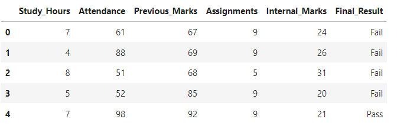
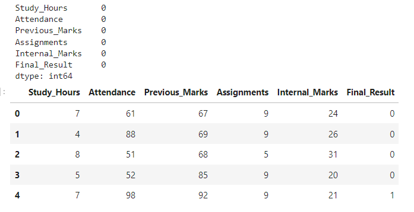
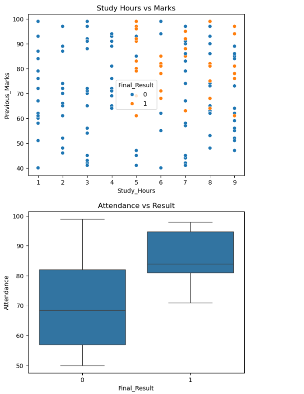
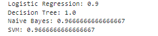
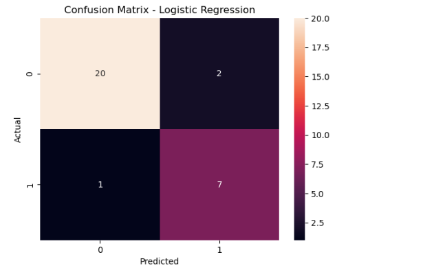
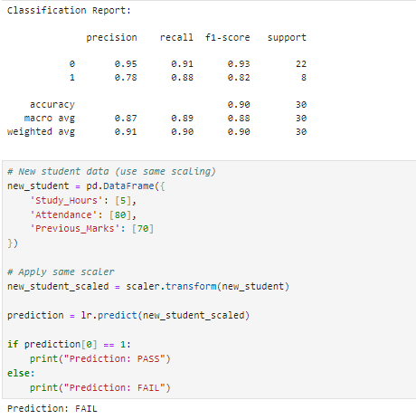

# Student Performance Prediction System

## Project Description
This project predicts student academic performance using Machine Learning techniques. It analyzes factors such as study hours, attendance, previous marks, and assignments to determine whether a student will pass or fail or achieve a certain grade.

## Objective
- Predict student academic performance
- Identify weak students at an early stage
- Help teachers take corrective actions
- Improve overall academic outcomes using data-driven insights

## Problem Statement
In traditional education systems:
- Tracking individual student performance is difficult
- Early identification of weak students is challenging
- Decisions are often based on assumptions rather than data

## Proposed Solution
The system:
- Takes student data as input
- Trains machine learning models
- Predicts performance (Pass/Fail or Grade)

## Technologies Used
- Python
- Pandas
- NumPy
- Scikit-learn
- Matplotlib / Seaborn
- Jupyter Notebook 

## Dataset Description
The dataset includes:
- Study Hours
- Attendance
- Previous Marks
- Assignments
- Internal Marks
- Final Result (Target)

## Methodology
1. Data Collection  
2. Data Preprocessing  
3. Exploratory Data Analysis (EDA)  
4. Feature Selection  
5. Model Selection (Logistic Regression, Decision Tree, etc.)  
6. Model Training  
7. Prediction  
8. Evaluation (Accuracy, Precision, Recall, F1-Score)

## System Modules
- Data Input Module  
- Data Processing Module  
- Model Training Module  
- Prediction Module  
- Visualization Module  

## Expected Output
- Student performance prediction  
- Graphical analysis  
- Identification of at-risk students

## Output Screenshots

### Dataset Preview

### Categorical Conversion

### Graphs

### Model Accuracy

### Confusion Matrix

### Final Prediction

These outputs demonstrate the working and performance of the Student Performance Prediction System.

## Advantages
- Early detection of weak students  
- Improves teaching strategies  
- Data-driven decision making  
- Saves time  

## Limitations
- Depends on data quality  
- Cannot capture emotional factors  
- Accuracy depends on dataset

 ## Future Enhancements
- Real-time tracking system  
- Mobile app integration  
- Personalized learning recommendations

 ## Author
 **Varshini S**
